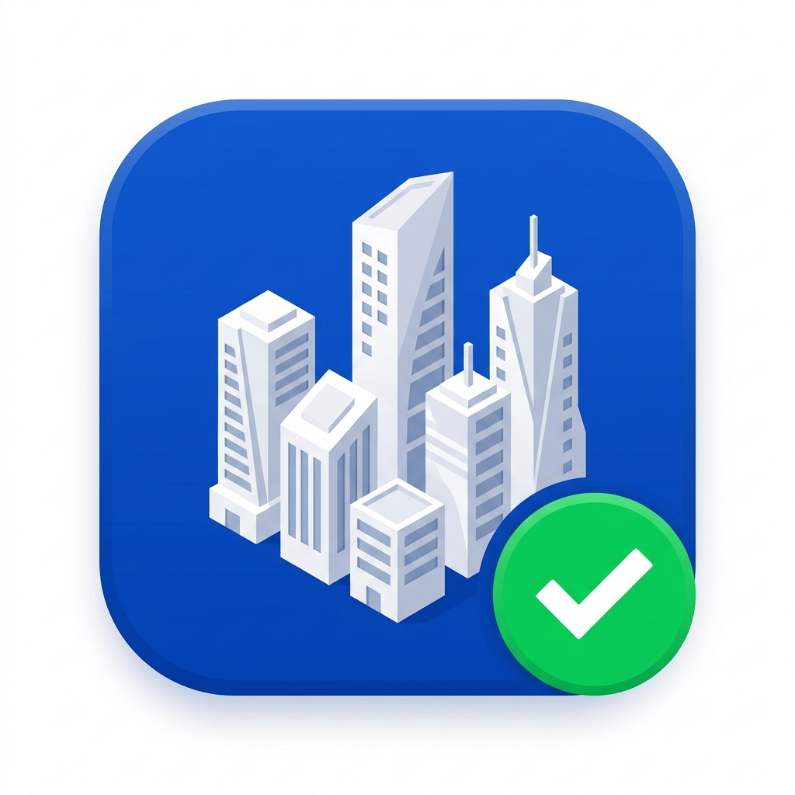

<div align="center">
  
  <h1>SmartClearance</h1>
  <p><strong>Unified Government Single Window Clearance & Compliance Scrutiny Platform</strong></p>
  <p>Empowering businesses with streamlined statutory approvals and enabling departmental nodal officers with synchronized digital scrutiny.</p>

  <p>
    <a href="#-key-features"></a>
    <a href="https://react.dev/"></a>
    <a href="https://vitejs.dev/"></a>
    <a href="https://www.typescriptlang.org/"></a>
    <a href="https://tailwindcss.com/"></a>
    <a href="https://supabase.com/"></a>
    <a href="#-license"></a>
  </p>
</div>

---

## 📖 Table of Contents
1. [Executive Summary & Problem Statement](#-executive-summary--problem-statement)
2. [Dual-Persona Architecture](#-dual-persona-architecture)
3. [Comprehensive Feature Walkthrough](#-comprehensive-feature-walkthrough)
   - [Applicant / Entrepreneur Experience](#1-applicant--entrepreneur-experience)
   - [Government Officer Scrutiny Console](#2-government-officer-scrutiny-console)
   - [AI & Intelligence Engine](#3-ai--intelligence-engine)
4. [System Architecture & Data Flow](#-system-architecture--data-flow)
5. [Directory & Project Structure](#-directory--project-structure)
6. [Tech Stack & Dependencies](#-tech-stack--dependencies)
7. [Installation & Local Setup](#-installation--local-setup)
8. [Supabase Cloud Storage Integration](#-supabase-cloud-storage-integration)
9. [Demo Accounts & User Switching](#-demo-accounts--user-switching)
10. [Deployment Guide](#-deployment-guide)
11. [Roadmap](#-roadmap)
12. [License & Acknowledgments](#-license--acknowledgments)

---

## 🏛️ Executive Summary & Problem Statement

Setting up, commissioning, and operating an industrial manufacturing plant or commercial establishment is traditionally hindered by administrative friction:
- **Fragmented Portals:** Entrepreneurs must juggle 12+ separate state and municipal websites (Fire Service, Pollution Control Board, Electricity Utility, Town Planning, Factories Inspectorate, Water Board).
- **Repetitive Submissions:** Identical copies of structural layouts, certificates of incorporation, environmental impact assessments, and land titles must be repeatedly uploaded and physically submitted.
- **Unclear Statutory Dependencies:** Approvals often depend on prerequisite clearances (e.g., Factory Building Plan requires prior Town Planning and Fire Safety NOCs), leading to avoidable delays.
- **Black-Box Scrutiny & SLA Violations:** Applicants lack visibility into the exact desk or officer reviewing their file, making statutory dispute or delay escalation cumbersome.

**SmartClearance** addresses these challenges through a unified **Single Window Clearance System (SWCS)** engineered with **Government-to-Business (G2B)** and **Government-to-Government (G2G)** synchronization.

---

## 👥 Dual-Persona Architecture

SmartClearance operates with synchronized role-based contexts:

| Persona | Primary Goals | Key Capabilities |
| :--- | :--- | :--- |
| **🏢 Business / Entrepreneur** | Fast project commissioning & compliance certainty | Multi-stage tracker, Approval Navigator, Common Inspection booking, Auto-Doc Vault, Subsidy claims, 1-click SLA Escalation. |
| **🛡️ Statutory Officer** | Efficient scrutiny & risk-free legal sanctions | Unified Inward Register, Digital Stamping, Formal Deficiency Requisition, Pre-validated MCA/UIDAI dossier inspections. |

State is live-synchronized via React Context and Supabase — when an officer sanctions an application or raises a query, the applicant receives an instant notification and updated timeline status in real-time.

---

## 🚀 Comprehensive Feature Walkthrough

### 1. Applicant / Entrepreneur Experience

#### 📊 Consolidated Executive Dashboard
- **Real-Time KPIs:** Live clearance count, approved & active licenses, pending scrutiny dockets, and active capital subsidies.
- **Overall Commissioning Gauge:** Dynamic circular percentage tracking enterprise readiness for statutory commercial operation.
- **Interactive Stepper:** Visual tracking of application stages: *Drafting ➔ Submitted ➔ Scrutiny ➔ Site Inspection ➔ Statutory Sanction*.

#### 📋 My Approvals Register & Application Dossier
- Complete catalog of state clearances:
  - **Fire NOC** (Directorate of Fire & Emergency Services)
  - **MSEDCL High-Tension (HT) Power Feeder Sanction** (State Electricity Distribution)
  - **Factory License (Form 2)** (Directorate of Industrial Safety & Health - DISH)
  - **Air & Water Consent to Operate (CTO)** (State Pollution Control Board - SPCB)
  - **Tree Felling & Green Corridor Exemption** (Forest & Tree Authority)
- **Detailed Docket Inspection:** Per-clearance document requirements, officer notes, statutory fees breakdown, and expected SLA countdowns.

#### 🧭 Smart Approval Navigator
- Decision-tree checklist filtering exact statutory clearances based on:
  - **Industry Classification:** Red / Orange / Green / White Category (Pollution Index).
  - **Capital Investment:** Micro (< ₹1 Cr), Small (< ₹10 Cr), Medium (< ₹50 Cr), Large (> ₹50 Cr).
  - **Power & Utility Demands:** Low Tension (LT) vs. Dedicated 11kV/33kV HT lines.
  - **Location & Zoning:** MIDC Industrial Zone, Special Economic Zone (SEZ), Municipal Area, or Non-Agricultural (NA) converted land.

#### 🗄️ Unified Document Vault with Inter-Departmental Reuse
- Upload once, submit everywhere: Validated files are tagged with cryptographic hashes.
- Categorized dossier: Architectural Layouts, PAN/GST Certificates, EIA Reports, Machine Catalogs, Property Titles.
- Supports instant upload to Supabase Storage with local cached fallback.

#### 💰 Schemes, Subsidies & Incentives Engine
- Direct eligibility calculator for industrial policies:
  - **Capital Investment Subsidy:** Up to 25% grant on eligible plant & machinery.
  - **Electricity Duty Waiver:** 100% exemption for 7 consecutive years in backward districts.
  - **Green Industry & Effluent Treatment Grant:** Subsidies for Zero Liquid Discharge (ZLD) plants.
  - **Stamp Duty & Registration Refund:** Complete waiver on industrial land conveyance deeds.

#### 🔍 Common Inspection Platform (Joint Visits)
- Harmonizes scheduling so that Fire, Factories, and Environmental inspectors visit the industrial site simultaneously.
- Eliminates multiple site disruptions and conflicting departmental inspection notes.

#### ⚖️ Statutory Grievance & SLA Delay Escalation
- Automated SLA monitoring based on Public Services Delivery Guarantee Acts (e.g., Right to Public Services Act).
- If statutory deadlines expire, the entrepreneur can trigger a **1-Click Escalation to the First Appellate Authority**, with automated timestamped tracking.

---

### 2. Government Officer Scrutiny Console

- **Unified Inward Register:** Filter applications across *All Requests*, *Under Scrutiny*, *Queries Raised*, and *Sanctioned*.
- **Quick Search & Filter:** Instant multi-field search by application reference (`APP-2026-FIRE-01`), department, or clearance title.
- **1-Click Statutory Sanction:** Issues digitally signed approval certificates, moving the applicant's status to **Approved**.
- **Formal Query / Deficiency Requisition:** Dispatches specific engineering queries (e.g., *"Setback distance in North elevation layout lacks 6-meter fire tender turning radius"*), transitioning the status to **Query Raised** and notifying the business.
- **Document Scrutiny Bench:** Officers can inspect raw PDFs, view MCA/UIDAI verified hashes, and click **Mark Verified** on individual submitted drawings.

---

### 3. AI & Intelligence Engine

- **Automated Document Field Extraction:** Simulates intelligent OCR parsing of uploaded files, extracting registered entity names, license validity dates, and authorized signatories.
- **Predictive Clearance Timeline:** Estimates approval completion based on historical departmental processing averages.
- **Built-in AI Assistant:** In-portal contextual assistant answering questions regarding industrial zoning rules, statutory fee schedules, and required NOC checklists.

---

## 📐 System Architecture & Data Flow

```
┌─────────────────────────────────────────────────────────────────┐
│                      Client Frontend (React 19)                 │
├───────────────────────────────┬─────────────────────────────────┤
│    🏢 Entrepreneur Portal     │     🛡️ Officer Scrutiny Console  │
│  - Approvals & Navigator      │  - Inward Register              │
│  - Document Vault             │  - Digital Sanction Stamping    │
│  - Schemes & Common Inspect   │  - Query / Deficiency Dispatch  │
│  - SLA Delay Escalation       │  - Pre-validated Verification   │
└───────────────┬───────────────┴─────────────────┬───────────────┘
                │                                 │
                ▼                                 ▼
┌─────────────────────────────────────────────────────────────────┐
│                   AppContext (Shared State Sync)                │
│       - Reactive State Synchronization across User & Officer    │
│       - Persistent Local Storage & Status Tracking              │
└───────────────┬─────────────────────────────────┬───────────────┘
                │                                 │
                ▼                                 ▼
┌───────────────────────────────┐ ┌───────────────────────────────┐
│        Supabase Cloud         │ │        AI / Gemini Engine     │
│  - PostgreSQL Database        │ │  - Document OCR & Extraction  │
│  - Document Storage Buckets   │ │  - Intelligent Query Support  │
└───────────────────────────────┘ └───────────────────────────────┘
```

---

## 📁 Directory & Project Structure

```
smart-clearance/
├── public/                       # Public static assets & favicon icons
│   ├── app-logo.png              # Primary application high-res icon
│   ├── logo.png                  # Brand logo
│   └── placeholder-*.svg         # Asset placeholders
├── src/
│   ├── assets/                   # Vector graphics and UI illustrations
│   ├── components/               # Modular reusable UI components
│   │   ├── CircularProgress.tsx  # Animated completion rings
│   │   ├── Logo.tsx              # Brand logo & responsive marks
│   │   ├── Sidebar.tsx           # Collapsible navigation drawer
│   │   ├── StatusBadge.tsx       # Color-coded statutory status pills
│   │   ├── Stepper.tsx           # Multi-step progress bars
│   │   └── TopBar.tsx            # Global search, profile, notifications
│   ├── context/
│   │   └── AppContext.tsx        # Centralized state (approvals, docs, sync)
│   ├── data/
│   │   └── mockData.ts           # Initial departmental clearance dockets
│   ├── lib/
│   │   └── supabase.ts           # Supabase client initializer
│   ├── pages/                    # Core view routing
│   │   ├── AdminDashboardPage.tsx # Statutory Officer scrutiny bench
│   │   ├── AIAssistantPage.tsx   # Conversational assistance
│   │   ├── AIInsightsPage.tsx    # Predictive compliance analytics
│   │   ├── ApplicationDetailPage.tsx # Drill-down dossier scrutiny
│   │   ├── ApprovalNavigatorPage.tsx # Guided checklist questionnaire
│   │   ├── CompliancePage.tsx    # Recurring statutory compliance
│   │   ├── DashboardPage.tsx     # Entrepreneur master overview
│   │   ├── DocumentsPage.tsx     # Centralized Document Vault
│   │   ├── GovernmentServicesPage.tsx # Service catalog directory
│   │   ├── GrievancesPage.tsx    # SLA delay grievance escalation
│   │   ├── InspectionsPage.tsx   # Joint physical inspection manager
│   │   ├── LandingPage.tsx       # Public informational gateway
│   │   ├── LoginPage.tsx         # Dual-role authentication screen
│   │   ├── MyApprovalsPage.tsx   # Detailed clearance register
│   │   ├── NotificationsPage.tsx # Actionable alerts & query updates
│   │   ├── ProfilePage.tsx       # Industrial enterprise credentials
│   │   └── SchemesPage.tsx       # State subsidies & financial grants
│   ├── types/                    # TypeScript interfaces & types
│   ├── App.tsx                   # Main app router & role switchboard
│   ├── index.css                 # Tailwind CSS v4 styling rules
│   └── main.tsx                  # Application entry point
├── .env.example                  # Environment template
├── index.html                    # HTML entry point with metadata
├── package.json                  # Dependencies and build scripts
├── tsconfig.json                 # TypeScript compiler configuration
└── vite.config.ts                # Vite build configuration
```

---

## 💻 Tech Stack & Dependencies

| Layer | Technology | Details |
| :--- | :--- | :--- |
| **Framework** | [React 19](https://react.dev/) | Modern functional components, hooks, concurrent features |
| **Tooling** | [Vite 8](https://vitejs.dev/) | Lightning-fast HMR and bundle optimization |
| **Language** | [TypeScript 5](https://www.typescriptlang.org/) | End-to-end type safety and explicit interfaces |
| **Styling** | [Tailwind CSS 4](https://tailwindcss.com/) | Modern utility-first CSS with direct color token customization |
| **Icons** | [Lucide React](https://lucide.dev/) | Clean, accessible vector icons |
| **Cloud Storage** | [Supabase](https://supabase.com/) | PostgreSQL backend and resilient S3-compatible file storage |
| **Animation** | Motion / CSS3 | Micro-interactions and animated state transitions |

---

## 🛠️ Installation & Local Setup

### Prerequisites
- **Node.js** >= 18.0.0
- **npm**, **yarn**, or **bun**

### Step-by-Step Setup

1. **Clone the repository:**
   ```bash
   git clone https://github.com/your-username/smart-clearance.git
   cd smart-clearance
   ```

2. **Install project dependencies:**
   ```bash
   npm install
   ```

3. **Configure Environment Variables:**
   ```bash
   cp .env.example .env
   ```
   *(Optional: If connecting live Supabase storage, fill in the values described below. The app operates out-of-the-box in local mode without credentials).*

4. **Start the local development server:**
   ```bash
   npm run dev
   ```
   Open **[http://localhost:3000](http://localhost:3000)** in your browser.

5. **Typecheck & Lint:**
   ```bash
   npm run lint
   ```

---

## ☁️ Supabase Cloud Storage Integration

To allow real-time binary document uploads into a centralized cloud repository:

1. Sign in to your dashboard at [supabase.com](https://supabase.com) and create a project.
2. In the left navigation, click on **Storage**.
3. Click **New Bucket**, name it `documents`, and ensure **Public Bucket** is checked.
4. Open **Project Settings > API** and copy:
   - **Project URL**
   - **anon public API Key**
5. Add these credentials into your `.env` file:
   ```env
   VITE_SUPABASE_URL=https://xxxxxxxxxxxxxxxxxxxx.supabase.co
   VITE_SUPABASE_ANON_KEY=eyJhbGciOiJIUzI1NiIsInR5cCI6IkpXVCJ9...
   VITE_SUPABASE_STORAGE_BUCKET=documents
   ```
Uploaded files in the **Document Vault** will automatically upload to Supabase Storage with verifiable public URLs!

---

## 🔑 Demo Accounts & User Switching

You can switch between roles dynamically or test authentication:

| Role | Username / Email | Password | Included Features |
| :--- | :--- | :--- | :--- |
| **Applicant / Business** | `entrepreneur@industry.com` | `admin123` *(any)* | Full business dashboard, approval tracking, document vault, subsidy applications |
| **Statutory Scrutiny Officer** | `officer@singlewindow.gov.in` | `admin123` *(any)* | Department Inward Register, digital document verification, statutory sanction, query dispatch |

> **Pro-Tip:** While logged in as an Officer, use the **"Switch to Applicant View"** button in the top navigation bar to instantaneously inspect the entrepreneur perspective!

---

## 🚢 Deployment Guide

### Deploying on Vercel

1. Push the code to a GitHub repository.
2. Visit [Vercel](https://vercel.com/) and click **Add New Project**.
3. Select your repository. Vercel automatically detects the Vite configuration:
   - **Build Command:** `npm run build`
   - **Output Directory:** `dist`
4. Add your Environment Variables (`VITE_SUPABASE_URL`, `VITE_SUPABASE_ANON_KEY`).
5. Click **Deploy**.

### Building for Docker / Production Server
```bash
# Build the production bundle
npm run build

# Preview locally
npm run preview -- --port 8080
```

---

## 🗺️ Roadmap

- [x] Single Window Clearance Dashboard & Progress Trackers
- [x] Multi-persona Officer Scrutiny Console & Digital Stamping
- [x] Unified Document Vault with Pre-Validation Hashes
- [x] Automated SLA Breach & 1-Click Appellate Escalation
- [x] Cloud Storage synchronization via Supabase
- [ ] DigiLocker & MCA21 direct API integration
- [ ] Multi-lingual interface support (Regional languages)
- [ ] Geo-tagged GIS site inspection photographic logs

---

## 📄 License & Acknowledgments

This project is licensed under the **MIT License** — feel free to modify and distribute for both commercial and public-sector digital initiatives.
